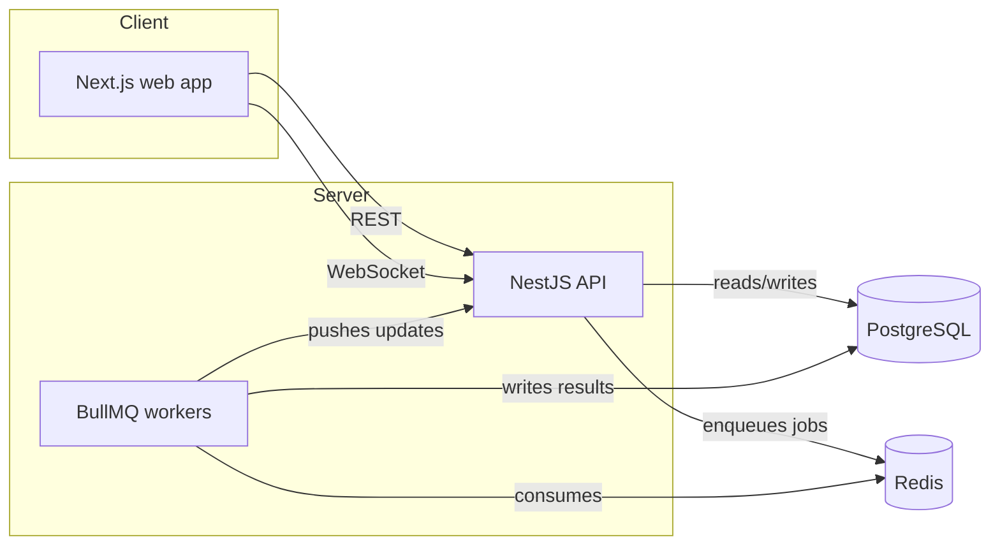

# Architecture — Ashen Contracts

High-level technical overview. The *why* behind each choice lives in `docs/DECISIONS.md` — this file is the *what* and *how*.

## System overview



## Repository structure (pnpm workspaces monorepo)

```
apps/
  web/          Next.js frontend (TypeScript)
  api/          NestJS backend (TypeScript)
packages/
  ui/           Shared component library, documented in Storybook
  shared/       Shared types/DTOs used by both web and api
docs/           Game design, roadmap, architecture, decisions
```

A single repo keeps `apps/web` and `apps/api` in sync on shared types (`packages/shared`) without manual duplication or publishing an internal npm package — see `docs/DECISIONS.md` #002 for the full reasoning.

## Frontend (`apps/web`)
- **Next.js + TypeScript**, styled with Tailwind
- Components consumed from `packages/ui` (`import { Button } from "@ashen-contracts/ui"`) rather than duplicated locally
- Talks to the API over REST for standard requests, and over a WebSocket connection (Socket.io client) for real-time push (e.g. "your training has finished")

## Component library (`packages/ui`)
- Documented and developed in isolation with **Storybook**
- Published/hosted separately via **Chromatic** so the design system has its own shareable, public link independent of the game itself
- Consumed by `apps/web` as a workspace package (`workspace:*`), not copy-pasted

## Backend (`apps/api`)
- **NestJS** for structure (modules, DI, testability) over a bare Express app
- **PostgreSQL** as the primary data store (players, characters, inventory, world state)
- All time-and-resource-sensitive logic (energy regeneration, skill checks, action costs) is calculated **server-side only** — the client is never trusted with authoritative state (`docs/DECISIONS.md` #003)

## Background jobs (Redis + BullMQ)
Any player action with a real-world duration (training, crafting, later: building) is handled as a queued, delayed job rather than a timer trusted to survive in memory:
1. API receives the action request, validates it, enqueues a job with the resolve time
2. A BullMQ worker picks up the job when it's due, applies the result to the database
3. The result is pushed to the client via WebSocket if they're connected, or fetched on next load otherwise

This survives server restarts and scales past a single process — see `docs/DECISIONS.md` #001.

## Real-time (Socket.io)
Used for push notifications only (action completed, event triggered) — not for gameplay-critical state. If a socket connection drops, the client falls back to fetching current state on reconnect/reload, so the game never depends on the socket staying alive.

## Testing
- **Jest** — unit tests, focused on the logic that actually carries risk: resource math, queue job handlers, skill-check resolution
- **Cypress** — end-to-end coverage of the core loop (create character → run expedition → resolve event)

## Deployment
| Component | Platform | Notes |
|---|---|---|
| `apps/web` | Vercel | Root Directory set to `apps/web`; Vercel installs from the workspace root so `packages/ui` and `packages/shared` resolve correctly |
| `apps/api` | Railway / Render | Deployed via Dockerfile (multi-stage build copying required `packages/*`) |
| PostgreSQL | Railway / Render managed instance | |
| Redis | Railway / Render managed instance | Required by BullMQ |
| `packages/ui` (Storybook) | Chromatic | Separate public link, independent of the game deployment |

## Local development
`docker-compose.yml` (planned) will spin up local PostgreSQL and Redis so `pnpm dev` works end-to-end without manual service setup.